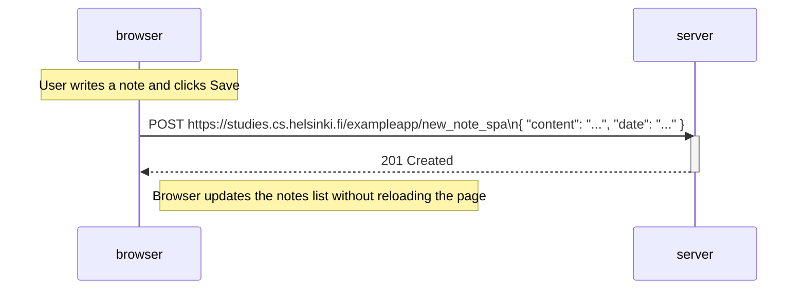

```mermaid
sequenceDiagram
    participant browser
    participant server

    Note over browser: User writes a note and clicks Save

    browser->>server: POST https://studies.cs.helsinki.fi/exampleapp/new_note_spa\n{ "content": "...", "date": "..." }
    activate server
    server-->>browser: 201 Created
    deactivate server

    Note right of browser: Browser updates the notes list without reloading the page
```
